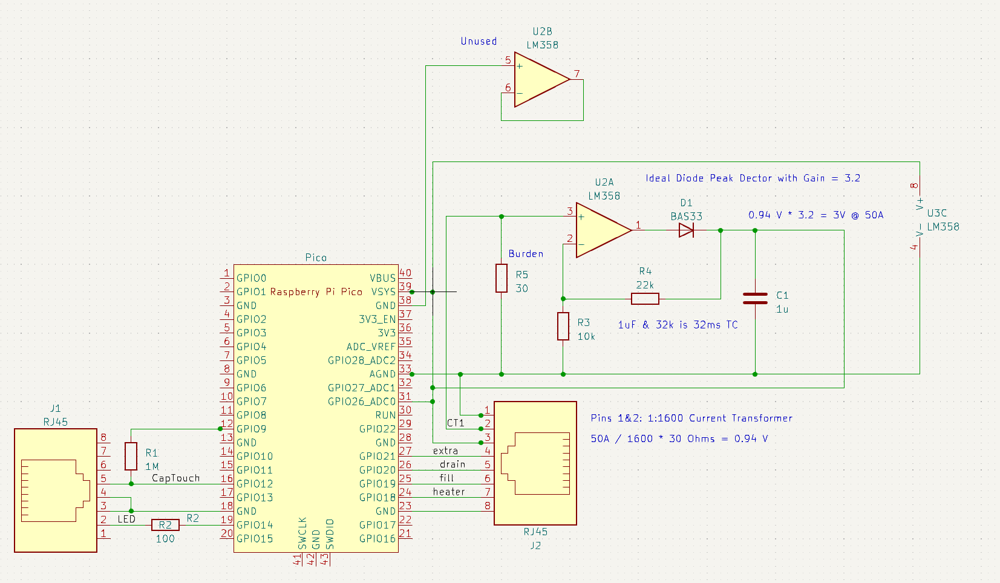

# PicoSteamControl
Pico control for a Leisure Steam One Touch LS series.

This is my first MicroPython project.  I was originally implementing this system in C, but when I started down the path to connect to WiFi, I decided to try out MicroPython and I was blown away by the power and rapid development/test cycles.

I mostly think this project might be interesting to people because of a few new ideas that I have not seen documented well in the wild:

# New ideas:

This project served as a testbed for 3 new ideas that I wanted to try:
- Status Logging and Timestamping though WiFi
- Capacitive Touch Sensing via PIO State Machine
- New Ideal Diode Peak Detector CT Interface

## Status Logging and Timestamping though WiFi

A major reason I was implementing much of my IoT work with boards that run full Linux (usually a Raspberry Pi Zero W) is logging and timestamping functionality.  Many of these IoT systems are very difficult to debug without a persistent log that is timestamped.  Both storing and retrieving persistent logs (to some sort of nonvolatile memory) and getting real time on a microcontroller are difficult.

Here, this is solved by using the network and urequests libraries:

```python
def logWifi(logmessage):
    print('Log: ' + logmessage)
    res = requests.post(secrets.url, data = logmessage)
```

Remarkably simple and effective, this server could easily serve many Pico W boards. See main.py for the full code with WiFi reconnection, and error handling.

The logWifi() function in main.py takes the log request and sends it to a http server (SteamLogger.js) running in Node.js that timestamps it and writes it to a file.

```node
const server = http.createServer((req, res) => {
  if (req.method === 'POST') {
    let data = '';
    req.on('data', chunk => {
      data += chunk.toString();
    });
    req.on('end', () => {
      let curDate = new Date();
      let dateStr = curDate.toString();
      message = dateStr.slice(0,dateStr.length-33) + ' ' + data; //Prepend Time to message
      console.log(message);
      logfile.write(message + '\n')
      res.end('OK');
    });
  }
});
```

## Capacitive Touch Sensing via PIO State Machine

After discovering that the control button on the LS1 one touch is a capacitive membrane switch, I investigated specific ICs that do capacitive touch sensing, but then this is a perfect task for a PIO state machine. It is very reliable and has very good dynamic range: Around 250K cycles for the untouched state, and with a strong push increasing this to 6-8M cycles.  A logging function serves to measure this. 

A very unoptimized PIO state machine that charges a capacitive touch sensor via an output pin and a resistor, then cycle counts
[I’ve broke this out into its own repository] ( https://github.com/jeremyrode/RaspPiPicoTouchSensor "RaspPiPicoTouchSensor Repo"), and I might try to optimize it eventually.

```
pull(block)                 # Get charge delay val     
mov(x,osr)                  # Load charge delay val    
wrap_target()               # Only do the above once   
mov(y, invert(null))        # Set Y to Large (All Ones)
set(pins, 1)                # Start Charging           
label("innerloop")                                     
jmp(pin, "loopescape")      # If Pin is High, Escape   
jmp(y_dec, "innerloop")     # Loop and decrement Y     
label("loopescape")                                    
mov(isr,y)                  # Move Y to CPU SR         
set(pins, 0)                # Discharge                
push(noblock)               # Push Y                   
mov(y,x)                    # Load charge delay val    
label("chargeloop")                                    
jmp(y_dec, "chargeloop")     # If !Zero, X-- and loop  
wrap()                                                 
```

### How it Works

This code uses a PIO state machine to repeatedly charge via an output pin and 1 Mega Ohm resistor and detect a change in capacitance on the input pin.  The charge time is set by an initial value written in scratch register X, as the PIO SET instruction is limited to 31.  The state machine then sets Y to all ones, sets the charge pin to "1", and counts down until the input (jump pin) goes low.  The value is outputted, the charge pin is set to discharge "0", and then the discharge delay is performed.

The user space code calibrates the baseline charge time with an IIR filter, and if a difference (here 500 cycles or 4 us) in the charge time is detected a touch even is registered.  The touch detection is debounced via a time delay gate, as a single human touch event can trigger multiple detections.

```python
baseline = 350_000 # Inital state for baseline IIR Value for touch detection (350_000, connected, 4_000 bare PCB)
touch_threshold = 4_000_000 #Threshold above baseline for a touch (4_000_000, connected, 4_000 bare PCB)
time_between_touches_ms = 1000 #Debounce time for a touch
DATA_IIR_CONST = 1000  # Filtering constant for the IIR filter
while True:
    curval = 4_294_967_295 - sm.get() #State Machine counts down from 2^32
    if time.ticks_diff(time.ticks_ms(), last_touch) > time_between_touches_ms: #Not a multi-touch event
        if curval > baseline + touch_threshold: #We have a touch event
            last_touch = time.ticks_ms()
            print('Touch')
        else: #Only start taking button stats after the touch event has passed
            baseline = curval / DATA_IIR_CONST + baseline * (DATA_IIR_CONST - 1) / DATA_IIR_CONST #Take Baseline Stats
```

## New Ideal Diode Peak Detector CT Interface

Interfacing to Current Transformers (CT) is a real pain; either one needs to bias the signal in the middle of the ADC range, and sample fast enough to capture the 60 Hz sine wave, or a diode peak detector can be used, but that makes the circuit non-linear when the signal from the CT is below the diode threshold voltage.

Here, I’ve tried to make an ideal diode based peak detector (with gain) out of a non-inverting op amp driving though a diode.  Ideally this should make the ADC readout much simpler and more accurate, as the output is DC, and the time constant can be set via a capacitor.


## Goals
The factory control board was replaced with a quad relay board from amazon, wired directly to a RJ45 (J2) breakout board from Spark Fun.  This relay board replaces the factory control board, and is wired into the 220V fill solenoid, drain valve, and the 50A heater contactor.

Factory touchpad with LED is wired to J1.  Yes, I used another RJ45, when the actual plug is a 6P6C RJ12/18/25 style plug.  It works, but not well.

I have a round “One-touch” installed in my shower.  I reverse engineered it without removing it, so these are my best guesses that work.  A quick reverse engineering has the pilot LED with no ballast resistor on Pins 1 (anode) and 2 (cathode).  The capacitive touch front is on pin 4, and the ground is pin 3.  No idea on pins 5 and 6, these might be used for the digital control panel option, which I do not have.

# Schematic:

Note that this is the schematic that I built on a proto board with parts on hand.  I would recommend a proper ground and changing J1 to a RJ12 if I build a PCB (which I might do).



# Future Ideas
- Higher touch threshold for on than off
- Low/High via separate contactors for each heating element

