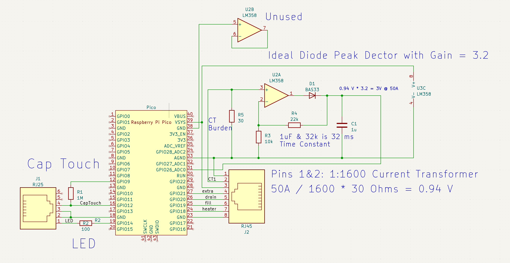

# PicoSteamControl
Pico control for a Leisure Steam One Touch LS series.  

Factor control board was replaced with a quad relay board from amazon, wired to RJ45 (J2).

Factory touchpad with LED is wired to J1.  Yes I used another RJ45, when the actual plug is a 6P6C RJ12/18/25 style plug.  It works, but not well.

Schematic:

